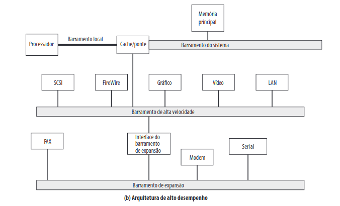

# Barramentos

Um barramento é uma estrutura que conecta a CPU (ou outros dispositivos) entre si. 
É através de um barramento que a memória, e dispositivos de entrada e saída (e.g. mouse, teclado, impressora, monitor, cabo de rede) se comunicam. 

Em um barramento, tipicamente (a exceção sendo o PCI Express), diversos dispositivos 
estão conectados ao mesmo tempo, e a transmissão ocorre em _broadcast_. Ou seja, 
quando um dispositivo transmite, todos os outros conectados àquele barramento podem
"escutar" a transmissão de dados. Para não lotar a linha de comunicação, apenas um
dispositivo deve transmitir por vez, enquanto os outros escutam.

Os dispositivos de entrada e saída (E/S) são divididos ainda em duas partes: o _**drive**_ (o dispositivo de E/S em si), e o controlador. O controlador e os dispositivos podem não estar contidos no dispositivo de E/S em si (por exemplo, o controlador pode ficar na placa-mãe, enquanto o dispositivo é conectado à placa-mãe por meio de um cabo).

**Figura 1:** Adaptada do livro do Tanenbaum.

A função de um controlador é gerenciar o acesso do dispositivo ao barramento. Quando um programa está lendo dados do disco, por exemplo, ele envia uma requisição ao 
controlador do disco, que então envia comandos de busca e leitura para o _drive_ de disco. Quando os dados requisitados são encontrados, é função do controlador escrever
estes dados na memória do computador, através de um fluxo serial de dados. 

Quando um dispositivo se comunica com a memória de um computador sem intervenção da 
CPU, dizemos que este dispositivo está fazendo acesso direto à memória, ou **Direct Memory Access (DMA)** na sigla em inglês. Uma vez que todos os dados requisitados são
escritos na memória, o controlador envia um sinal para a CPU, causando uma 
interrupção na execução do programa atual, e execução de uma rotina chamada **rotina 
de interrupção**. Esta rotina é responsável por verificar se os dados foram 
corretamente escritos na memória, executar tarefas em caso negativo, dentre outras 
atribuições. Finda a execução da rotina de interrupção, a CPU pode terminar de 
executar o programa que foi anteriormente suspenso da memória.

Quem controla quais dispositivos usarão o barramento em qual momento é um chip 
denominado **árbitro de barramento**. Geralmente este árbitro dá preferência a 
dispositivos de E/S, pois geralmente estes não podem ser parados no meio de uma 
execução (por exemplo, o leitor de um disco óptico). Quando nenhum dispositivo de E/S
está executando, então a CPU tem a preferência total, para referenciar a memória. 
Todavia, se um dispositivo de E/S precisar executar enquanto a CPU tem a preferência, 
então uma rotina de **roubo de ciclo** (_round robin_ em inglês) ocorre, onde o 
dispositivo de E/S tem a preferência.

Hoje em dia, o projeto de placas-mãe é feito de maneira que a CPU e dispositivos de 
entrada e saída compartilhem o menor número possível de barramentos, de forma que 
dispositivos rápidos (e.g. CPU, placas de vídeo) não sejam interrompidos por 
dispositivos lentos (e.g. discos magnéticos, leitores ópticos), como mostrado na 
figura abaixo.

**Figura 2:** diagrama lógico do chipset Intel z690. Repare como dispositivos rápidos (como memória RAM e dispositivos conectados à PCI express) comunicam-se diretamente 
com o processador, enquando dispositivos lentos (USB, SATA, Ethernet) passam pelo 
chipset.

**Figura 3:** diagrama lógico de barramentos, adaptado do livro Stallings. Você consegue identificar que tipo de arranjo o chipset Z690 segue?

Os caminhos de dados presentes em um barramento são divididos tipicamente em três categorias: Linhas de dados, linhas de endereço e linhas de controle (<a href="stallings.pdf#page=84">Stallings pp. 63-64</a>).

## Exemplos de barramentos

* PCI express
* SATA
* USB
* Thunderbolt

Mais exemplos na [Wikipedia](https://en.wikipedia.org/wiki/Bus_(computing)) (página em inglês).

<!-- Nos primórdios da computação, existia apenas um tipo de barramento, o ISA -- Industry
Standard Architecture (**nota:** não confundir com o ISA de Instruction Set 
Architecture). Este barramento era utilizado por diversos dispositivos, -->