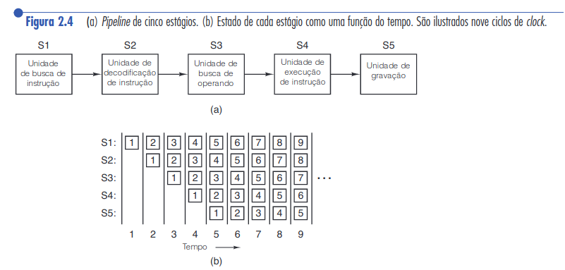

# Operação de um processador

## Execução típica de instruções pelo processador

Programa em Java que simula a busca, interpretação e execução de instruções
realizada tipicamente por um processador. Adaptado da <a href="tanenbaum.pdf#page=64">Figura 2.3 (página 45) do livro do
Tanenbaum.</a>


```java
public class Interp {
    static int PC; // contador de programa contém endereço da próxima instr
    static int AC; // o acumulador, um registrador para efetuar aritmética
    static int instr; // um registrador para conter a instrução corrente
    static int instr_type; // o tipo da instrução (opcode)
    static int data_loc; // o endereço dos dados, ou –1 se nenhum
    static int data; // mantém o operando corrente
    static boolean run_bit = true; // um bit que pode ser desligado para parar a máquina
    public static void interpret(int memory[ ], int starting_ address) {
        // Esse procedimento interpreta programas para uma máquina simples com instruções que têm
        // um operando na memória. A máquina tem um registrador AC (acumulador), usado para
        // aritmética. A instrução ADD soma um inteiro na memória do AC, por exemplo.
        // O interpretador continua funcionando até o bit de funcionamento ser desligado pela instrução HALT.
        // O estado de um processo que roda nessa máquina consiste em memória, o
        // contador de programa, bit de funcionamento e AC. Os parâmetros de entrada consistem
        // na imagem da memória e no endereço inicial.
        PC = starting_address;
        while (run_bit) {
            instr = memory[PC]; // busca a próxima instrução e armazena em instr
            PC = PC + 1; // incrementa contador de programa
            instr_type = get_instr_type(instr); // determina tipo da instrução
            data_loc = find_data(instr, instr_type); // localiza dados (–1 se nenhum)
            if (data_loc >= 0) // se data_loc é –1, não há nenhum operando
                data = memory[data_loc]; // busca os dados
                execute(instr_type, data); // executa instrução
            }
        }
        private static int get_instr_type(int addr) { ... }
        private static int find_data(int instr, int type) { ... }
        private static void execute(int type, int data) { ... }
    }
```

## Escolhas de design

Projetistas possuem duas opções: projetar um hardware para executar instruções em linguagem `L` 
diretamente, ou construir um interpretador para interpretar programas em `L`. Se
optar-se por um interpretador, também deve ser providenciado um hardware para executar
o próprio interpretador (que por sua vez é um programa).

Por razões econômicas, a máquina (i.e. hardware) que roda o interpretador deve ser 
mais simples que uma máquina que rodaria os programas em `L` nativamente - do 
contrário não faria sentido desenvolver o interpretador.

As vantagens de usar um interpretador são que correções podem ser aplicadas a um
processador mesmo quando este já foi comercializado, através de atualizações de 
software (no interpretador).

Outro aspecto importante de processadores é o tamanho das instruções que 
são executadas. Antigamente percebeu-se que usar instruções mais complexas 
acarretava em programas mais rápidos, mesmo que as instruções em si fossem
 demoradas de serem executadas. Um exemplo são instruções de ponto flutuante;
outro são instruções de manipulação matricial. Percebeu-se com o tempo que, por estas 
operações serem executadas geralmente em sequência, simplesmente criar uma instrução 
mais complexas que executasse as duas em sequência acarretava num aumento de desempenho. 

A **arquitetura** de um processador denomina o conjunto de instruções que este processador está executando. As arquiteturas mais populares atualmente são **x86**,
**x64**, **x86-64**, **ARM**, etc.


## RISC vs SISC

CISC era o padrão da indústria, até surgirem as máquinas RISC. As máquinas RISC
beneficiarem-se de questões de desempenho (quanto tempo demora para executar cada
instrução, a velocidade de acesso a memória, etc). As máquinas RISC não faziam 
uso de interpretadores, executando as instruções diretamente por hardware.

* **RISC**: Reduced Instruction Set Computer. Giram em torno de 50 instruções.
  Exemplo de arquitetura: ARM 
* **CISC**: Complex Instruction Set Computer. Giram em torno de 200, 300 instruções.
  Exemplo de arquitetura: x86

As máquinas RISC não substituíram totalmente as CISC no mercado pois projetistas de
processadores da Intel incorporaram conceitos RISC em processadores CISC. Instruções
mais simples eram processadas em um núcleo RISC, enquanto as mais complexas faziam
o processo comum do CISC, com interpretador. Como consequência, instruções mais
simples (que geralmente são as mais comuns) rodavam mais rápido, enquanto as mais
complexas (que também são, geralmente, mais raras) mais lentamente. Apesar desta
abordagem não ser tão rápida quanto um projeto RISC puro, permitia um hardware no
geral competitivo e retrocompatível.


## Considerações gerais sobre execução de instruções

* **Nem sempre as instruções são executadas na ordem do programa.** Alguns recursos 
  podem estar bloqueados (e.g. um dispositivo periférico), portanto as instruções
  são executadas de maneira que maximizem o desempenho do programa. Obviamente,
  se existe uma ordem de execução (e.g. a instrução 2 utiliza o resultado de uma
  operação realizada pela instrução 1), esta ordem deve ser mantida.
* Se for necessário buscar dados na memória, busque-os antes das instruções 
  precisarem destes dados (busca antecipada). Uma vez recuperados, armazene estes dados
  nos registradores do processador para rápido acesso.
* O pipelining permite a execução de uma instrução por ciclo de CPU, pelo paralelismo
  a nível de instrução. Cada etapa da execução de uma instrução (decodificação, busca, 
  execução) é executada por uma parte especializada do hardware, efetivamente dividindo
  a carga de trabalho. A figura 2.4, extraída do livro do Tanenbaum, exemplifica este 
  conceito.

  