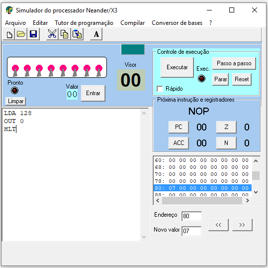
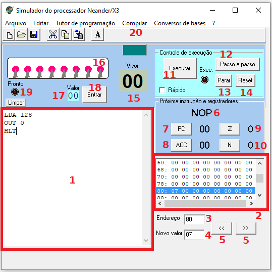
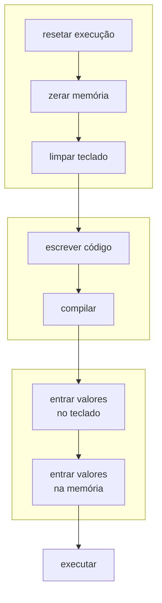

# Neander

## Sumário

* [Arquitetura](#arquitetura)
    * [Instruções](#instruções) 
* [Organização](#organização)
* [Vídeos no Youtube](#vídeos-no-youtube)
* [Exercícios](#exercícios)

## Arquitetura

### Largura de dados e endereços: 8 bits

Ou seja, possui 256 endereços de memória, cada um armazenando 8 bits (1 byte) de 
informação

Instruções e dados são armazenados na mesma memória. As primeiras posições de
memória são utilizadas pelas instruções, quando o programa é compilado.

### Registradores

* 1 acumulador de 8 bits (ACC)
* 1 program counter de 8 bits (PC)
* 1 registrador de estado com 2 códigos de condição: N (negativo) e Z (zero)
    * Valores mudam após operações da ULA (e.g. ADD)

### Representação de valores negativos

* Dados representados em complemento de 2
* Vide <a href="tanenbaum.pdf#page=550">Representação de valores negativos</a> 
  no material

## Endereçamento

* Neander possui apenas endereçamento **DIRETO**. Logo após o código das 
  instruções, é seguido o endereço do operando
* Neander-X foi estendido para ter mais modos de endereçamento: imediato e 
indireto

### Modos de Endereçamento

#### Direto

O segundo byte da instrução é o endereço de memória do operando. Modo de 
endereçamento original do Neander.

#### Imediato

O segundo byte da instrução é o operando. A única instrução que usa este modo de 
endereçamento é a LDI, do Neander-X.

#### Indireto

O segundo byte da instrução contém o endereço de memória onde está o endereço do
operando (ou seja, o segundo byte da instrução é o endereço do ponteiro para o 
operando). Para indicar que um operando é indireto, deve-se precedê-lo pela letra 
`@` (arroba).

## Interface gráfica

Na imagem abaixo, à esquerda, está a interface gráfica do Neander-X, como a 
visualizamos quando iniciamos o programa. Na imagem abaixo, à direita, os diversos
elementos gráficos do programa estão numerados. O que cada elemento gráfico faz
está descrito logo abaixo.

### Elementos do Neander-X

1. Editor de texto: onde programamos o código-fonte. **É o único local do Neander-X
   onde os números estão na base decimal. Todos os outros locais mostram números
   na base hexadecimal.**
2. Memória: uma tabela com 256 posições, cada posição sendo um endereço de memória.
   No começo de cada linha, é mostrado o endereço da posição de memória mais à
   esquerda da linha. Cada posição de memória armazena um valor binário de 8 bits
   (valores entre 0 e 255).
3. Uma caixa de texto onde podemos selecionar qual posição da memória queremos
   acessar.
4. O valor armazenado naquela posição de memória.
5. Botões que levam para as posições de memória anterior (esquerda) e posterior 
   (direita) à posição atual.
6. Um visor que mostra qual a próxima instrução a ser executada.
7. O valor do registrador PC (Program Counter).
8. O valor do registrador ACC (acumulador).
9. O valor do flip-flop Z (mostra se a última operação da ULA resultou em um valor
   nulo, zero).
10. O valor do flip-flop N (mostra se a última operação da ULA resultou em um valor
   negativo).
11. Botão para executar todas as instruções de uma vez só. **Certifique-se que
    compilou o código primeiro!**
12. Botão para executar instrução-por-instrução. Precisa ser pressionado novamente
    a cada nova instrução que for executada.
13. Botão para parar a execução de um programa.
14. Botão para reiniciar a execução de um programa.
15. Visor de saída. É o dispositivo `0` da instrução `OUT`.
16. Conjunto de interruptores de entrada. É o dispositivo `0` da instrução `IN`.
17. Visor que mostra o valor que foi entrado nos interruptores de entrada.
18. Botão _Enter_; notifica que os valores inseridos nos interruptores estão 
   prontos para leitura.
19. Luz que mostra se os dados dos interruptores estão prontos para leitura. É
    o dispositivo `1` da instrução `IN`.
20. Botão para compilar o código-fonte.

## Passo-a-passo de execução de programas

## Instruções

| Código binário | Código hexadecimal |     Instrução |                                           Descrição |
|---------------:|-------------------:|:--------------|:----------------------------------------------------|
|      0000 0000 |                 00 | NOP           | não faz nada                                        |
|      0001 0000 |                 10 | STA `ender`   | armazena valor ACC na posição `ender` de memória    |
|      0010 0000 |                 20 | LDA `ender`   | carrega no ACC o valor na posição `ender` de memória |
|      0011 0000 |                 30 | ADD `ender`   | Soma ao acumulador o valor armazenado em `ender`    |
|      0100 0000 |                 40 | OR `ender`    | realiza um **OU** lógico entre ACC e valor em `ender` |
|      0101 0000 |                 50 | AND `ender`   | realiza um **E** lógico entre ACC e valor em `ender`  |
|      0110 0000 |                 60 | NOT           | inverte (complementa) acumulador                    |
|      0111 0000 |                 70 | SUB `ender`   | subtrai do acumulador o valor armazenado em `ender` |
|      1000 0000 |                 80 | JMP `ender`   | pula para a instrução na posição `ender` de memória |
|      1001 0000 |                 90 | JN `ender`    | pula para a instrução na posição `ender` de memória **APENAS SE** N = 1 |
|      1010 0000 |                 A0 | JZ `ender`    | pula para a instrução na posição `ender` de memória **APENAS SE** Z = 1 |
|      1011 0000 |                 B0 | JNZ `ender`   | pula para a instrução na posição `ender` de memória **APENAS SE** N = 0 |
|      1100 0000 |                 C0 | IN 0    | carrega valor da entrada (teclado) no ACC |
|      1101 0000 |                 D0 | OUT 0   | mostra no visor valor do ACC |
|      1110 0000 |                 E0 | LDI `imed`    | carrega o valor imediato `imed` no acumulador       |
|      1111 0000 |                 F0 | HLT           | término da execução (halt)                          |

**NOTA 1:** O comando IN recebe o endereço do **dispositivo de entrada**, e não de uma 
posição de memória. Atualmente, no Neander-X, os únicos dispositivos de entrada são 
os switches (valor 0) e o sinal de dados disponíveis (valor 1)

**NOTA 2:** o comando OUT recebe o endereço do **dispositivo de saída**, e não de uma 
posição de memória. Atualmente, no Neander-X, o único dispositivo de saída é o visor 
(valor 0).

**NOTA 3:** quando compilamos um programa, as instruções são colocadas nas primeiras
posições da memória. Você deve usar essas posições da memória nas instruções de desvio
(condicional ou incondicional).

### Pseudo-instruções

|      Instrução |                                                     Descrição |
|:---------------|:--------------------------------------------------------------|
| ORG `ender`    | coloca a próxima instrução  na posição ender de memória       |
| var EQU `imed` | atribui um nome (rótulo) à uma posição na memória            |
| END `ender`    | usado para pré-carregar o PC com o endereço inicial de execução do programa |
| DS `imed`      | (define storage) reserva um número de palavras na memória definido pelo valor `imed` |
| DB `imed`      | (define bytes) carrega esta palavra com o valor dado pelo operando `imed` |                

## Organização

A organização do Neander diz respeito aos aspectos **visíveis** de sua implementação, e pode ser visualizada na figura abaixo.

## Vídeos no Youtube

* [Características, Especificações, Arquitetura e Conjunto de Instruções](
https://youtu.be/lHppuOeUN3A?list=PLWwYNisj4aJP1QgaaNv2nlhRIYCHAeaqV)
* [Organização, Circuitos e Fluxo de Dados](
https://youtu.be/diAU-PBY1IY?list=PLWwYNisj4aJP1QgaaNv2nlhRIYCHAeaqV)

## Exercícios

A resolução dos exercícios está [aqui](neander/resoluções)

1. Crie um programa no Neander que leia um número pelo teclado (`IN 0`), outro 
pela memória, some ambos e mostre na tela.
2. Crie um programa no Neander que leia um número pelo teclado (`IN 0`), outro 
do código-fonte, com endereçamento imediato, some ambos e mostre na tela.
3. Crie um programa que some dois números, ambos escritos na memória, e mostre
   na tela o valor da flag `N`.
4. Crie um programa que, dado um número `x`, lido da memória, mostra o seu
   valor negativo, em complemento de 2.
5. Crie um programa que multiple dois números.
6. Crie um programa que eleve um número ao quadrado.
7. Crie um programa que faça a potência `x^y`

Mais exercícios na página do [neander](https://www.inf.ufrgs.br/arq/wiki/doku.php?id=neander).
