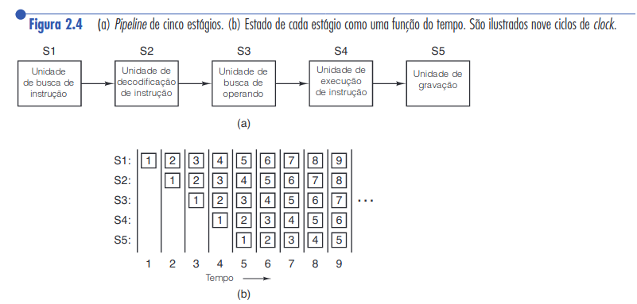

# Operação de um processador

## Execução típica de instruções pelo processador

O processo de busca e execução de instruções de um processador segue o seguinte fluxograma (adaptado da <a href="tanenbaum.pdf#page=64">Figura 2.3 (página 45) do livro do
Tanenbaum</a>):

## Escolhas de design

Projetistas possuem duas opções: projetar um hardware para executar instruções em linguagem `L` 
diretamente, ou construir um interpretador para interpretar programas em `L`. Se
optar-se por um interpretador, também deve ser providenciado um hardware para executar
o próprio interpretador (que por sua vez é um programa).

Por razões econômicas, a máquina (i.e. hardware) que roda o interpretador deve ser 
mais simples que uma máquina que rodaria os programas em `L` nativamente - do 
contrário não faria sentido desenvolver o interpretador.

As vantagens de usar um interpretador são que correções podem ser aplicadas a um
processador mesmo quando este já foi comercializado, através de atualizações de 
software (no interpretador).

Outro aspecto importante de processadores é o tamanho das instruções que 
são executadas. Antigamente percebeu-se que usar instruções mais complexas 
acarretava em programas mais rápidos, mesmo que as instruções em si fossem
 demoradas de serem executadas. Um exemplo são instruções de ponto flutuante;
outro são instruções de manipulação matricial. Percebeu-se com o tempo que, por estas 
operações serem executadas geralmente em sequência, simplesmente criar uma instrução 
mais complexa que executasse as duas em sequência resultaria em aumento de desempenho. 

A **arquitetura** de um processador denomina o conjunto de instruções que este processador está executando. As arquiteturas mais populares atualmente são **x86**,
**x64**, **x86-64**, **ARM**, etc. O conjunto de instruções da arquitetura x86 está disponível
na [Wikipédia](https://en.wikipedia.org/wiki/X86_instruction_listings).

## RISC vs CISC

A forma como as instruções são executadas (com ou sem interpretador), e o 
número de instruções do processador (muitas ou poucas) impactam na 
denominação do processador. Existem dois padrões na indústria atualmente, 
**RISC** e **CISC**: 

* **RISC**: Reduced Instruction Set Computer. Giram em torno de 50 instruções.
  Exemplo de arquitetura: ARM 
* **CISC**: Complex Instruction Set Computer. Giram em torno de 200, 300 instruções.
  Exemplo de arquitetura: x86

CISC era o padrão dominante, até surgirem as 
máquinas RISC. As máquinas RISC beneficiarem-se de questões de desempenho 
(quanto tempo demora para executar cada instrução, a velocidade de acesso 
a memória, etc). As máquinas RISC não fazem uso de interpretadores, 
executando as instruções diretamente por hardware.

As máquinas RISC não substituíram totalmente as CISC no mercado pois projetistas de
processadores da Intel incorporaram conceitos RISC em processadores CISC. Instruções
mais simples eram processadas em um núcleo RISC, enquanto as mais complexas faziam
o processo comum do CISC, com interpretador. Como consequência, instruções mais
simples (que geralmente são as mais comuns) rodavam mais rápido, enquanto as mais
complexas (que também são, geralmente, mais raras) mais lentamente. Apesar desta
abordagem não ser tão rápida quanto um projeto RISC puro, permitia um hardware no
geral competitivo e retrocompatível.

## Considerações gerais sobre execução de instruções

* **Nem sempre as instruções são executadas na ordem do programa.** Alguns recursos 
  podem estar bloqueados (e.g. um dispositivo periférico), portanto as instruções
  são executadas de maneira que maximizem o desempenho do programa. Obviamente,
  se existe uma ordem de execução (e.g. a instrução 2 utiliza o resultado de uma
  operação realizada pela instrução 1), esta ordem deve ser mantida.
* **Se for necessário buscar dados na memória, busque-os antes das instruções 
  precisarem destes dados (busca antecipada).** Uma vez recuperados, armazene estes dados
  nos registradores do processador para rápido acesso.
* **Use pipelining.** O pipelining permite a execução de uma instrução por ciclo de CPU, 
  pelo paralelismo a nível de instrução. Cada etapa da execução de uma instrução 
  (decodificação, busca, execução) é executada por uma parte especializada do hardware, 
  efetivamente dividindo a carga de trabalho. A figura 2.4, extraída do livro do Tanenbaum, exemplifica este conceito.

  