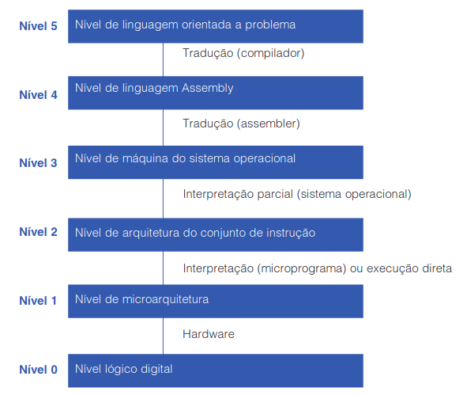

# Organização geral de computadores

Dois níveis de linguagens: L1 e L0

Para rodar um programa escrito em L1 em linguagem L0, existem
duas maneiras:

1. **Tradução:** converte instruções em L1 para instruções L0, 
   e executa o programa L0 diretamente no hardware. Gera um programa
   traduzido no processo.
2. **Interpretação:** programa escrito em L0 é chamado 
   **interpretador**, e recebe como entrada programa escrito em L1.
   O interpretador está rodando o tempo inteiro, e trata L1 como 
   dados.

Processo de programação demanda construir linguagens de programação cada
vez mais próximas da linguagem natural, abstraindo conceitos difíceis para
linguagens inferiores.

## Desenvolvidos por programadores de sistemas (geralmente interpretados)

* **Nível lógico digital:** possui portas (ou gates). Realizam ações simples como
  somas, operações lógicas (AND, OR) e, quando combinados em conjuntos maiores,
  podem armazenar bits que, quando estes então são combinados em conjuntos maiores, 
  viram registradores. Registradores armazenam números binários até um valor máximo
  arbitrário.
* **Nível de microarquitetura:** Possui diversos registradores e a **ULA: unidade lógica
  e aritmética**, que é capaz de realizar operações aritméticas simples. Os registradores
  conectam-se à ULA para formar um **caminho de dados**. A operação básica do caminho de 
  dados consiste em selecionar um ou mais registradores, e realizar alguma operação sobre
  os dados armazenados por estes registradores. 
* **Nível de arquitetura do conjunto de instrução:** também conhecida como ISA (Instruction
  Set Architecture). UM exemplo de ISA é a x86 (CISC), usada tanto por Intel quanto AMD. 
  Permite que processadores com organizações diferentes utilizem ainda o mesmo conjunto de 
  instruções. Outro ISA é o ARM (RISC), usado pela empresa homônima. Mais sobre CISC e RISC
  no decorrer do curso.
* **Nível de máquina do sistema operacional:** Nível híbrido que possui instruções do nível
  anterior, assim como novas instruções, uma organização de memória diferente, a capacidade
  de rodar um ou mais programas simultaneamente, assim como outros recursos. Em outras palavras,
  algumas instruções são interpretadas pelo sistema operacional, e outras pelo microprograma
  (o interpretador das instruções do nível anterior). 

## Desenvolvidos por programadores de aplicações (geralmente traduzidos)

* **Nível de linguagem de montagem (assembly):** Possuem abstrações que permitem que a 
  programação de aplicações não seja tão desagradável quanto programar em linguagem de máquina.
  Os programas escritos neste nível são traduzidos por um programa chamado **assembler**. 
* **Nível de linguagem orientada a problemas:** Possui linguagens denominadas de **alto nível**.
  Programas escritos neste nível são desenvolvidos por programadores interessados em resolver um
  problema específico. Linguagens neste nível incluem C, C++, Java, etc. Programas escritos nestas
  linguagens são (geralmente) traduzidos para níveis mais baixos por programas chamados **compiladores**. 
  Algumas linguagens de programação, contudo, são interpretadas. Java traduz programas para uma linguagem
  similar à ISA denominada bytes Java, onde então são interpretados por níveis mais baixos. 

> O conjunto de tipos de dados, operações e características de cada nível é denominado **arquitetura.**
  Características que o programador vê, como a quantidade de memória disponível, são parte da arquitetura.  

_Tanenbaum, Andrew S., and Wagner Luiz Zucchi. Organização estruturada de computadores. Pearson Prentice Hall, 2009._
